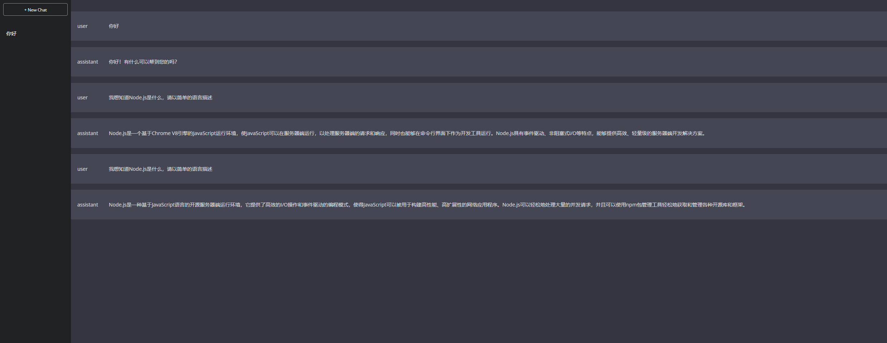

# Chatbot Application

This is a chatbot application built using React, Node.js, and the ChatGPT API.

## Description

The chatbot application allows users to interact with a chatbot powered by the ChatGPT API. Users can input messages, and the chatbot will respond with generated text based on the provided input. The application utilizes a client-server architecture, with the React frontend handling user input and displaying chat messages, and the Node.js backend communicating with the ChatGPT API to generate responses.

## Features

- User-friendly interface for interacting with the chatbot
- Real-time chat messages displayed in the interface
- Support for multiple chat sessions with different titles
- Integration with the ChatGPT API for generating responses
- Server-side handling of API requests for improved security

## Installation

1. Clone the repository: `git clone <repository-url>`
2. Install dependencies: `npm install`
3. Set up environment variables:
   - Create a `.env` file in the root directory of the project.
   - Add the following line to the `.env` file: `API_KEY=<your-api-key>`
4. Start the server and frontend:
   - Start the backend server: `npm run start:backend`
   - Start the frontend: `npm run start:frontend`
5. Access the application in your web browser at `http://localhost:3000`

Note: You need to obtain an API key from the ChatGPT API and replace `<your-api-key>` with your actual API key.

## Usage

1. Open the application in your web browser.
2. Enter your message in the input field and press Enter or click the "Send" button.
3. The chatbot will generate a response based on your input and display it in the chat interface.
4. You can create multiple chat sessions by clicking the "+ New Chat" button and selecting a chat title from the sidebar.
5. Previous chat messages are stored and can be accessed by selecting a chat title from the sidebar.

## Contributing

Contributions to the chatbot application are welcome! If you encounter any issues or have suggestions for improvements, please open an issue or submit a pull request.
